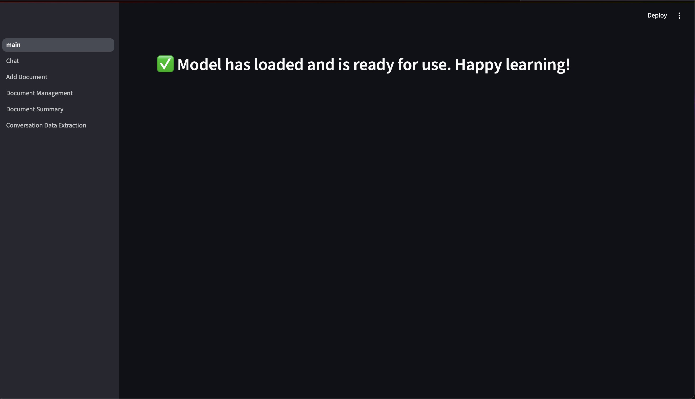
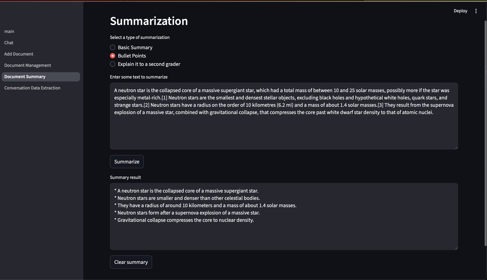
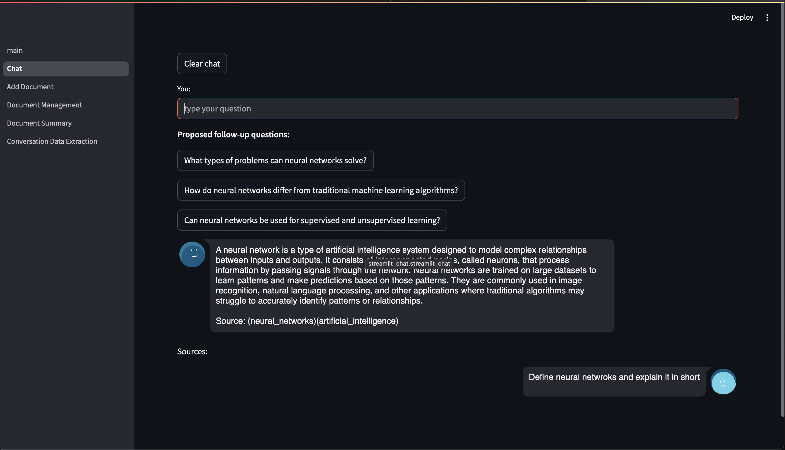

# RAGs-with-UI

Simple chatbot UI implementing RAG pipeline using `mistralai/Mistral-7B-Instruct-v0.1` as base LLM and `Milvus` as vector database with the feature to chunk and upload .pdf files as our internal knowledge base.

## Notes

To use Mistral-7B, you need to go to this link https://huggingface.co/mistralai/Mistral-7B-Instruct-v0.1 and request access (granted immediately), then run `huggingface-cli login` in terminal and paste the read token of huggingace (https://huggingface.co/settings/tokens).

## Demo

Run `streamlit run main.py` and wait for the model to load into GPU.

Summarize texts in different style :

And, finally chat with your PDFs via chatbot powered by RAG. It offers the capability to suggest follow-up questions relevant to your chat history and it shows the sources which it used to augment knowledge too!!

